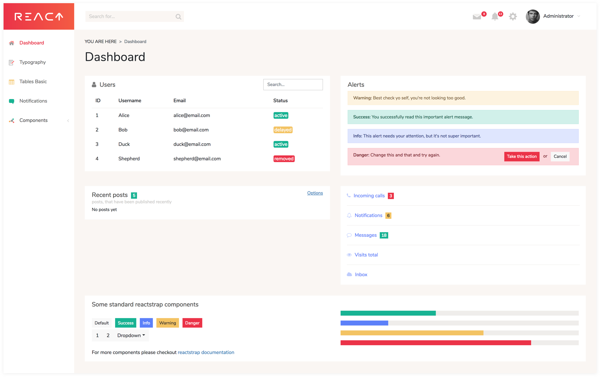

## React Dashboard — "[isomorphic](http://nerds.airbnb.com/isomorphic-javascript-future-web-apps/)" admin dashboard template
built with [React](https://facebook.github.io/react/), [Bootstrap](http://getbootstrap.com/), [React Router](https://reacttraining.com/react-router/),
[Redux](http://redux.js.org/) and [GraphQL](http://graphql.org/) based on
[Create React App](https://github.com/facebook/create-react-app) and latest industry best practices.

[View Demo](https://flatlogic.com/admin-dashboards/react-dashboard/demo) | [Download](https://github.com/flatlogic/react-dashboard.git) | [More templates](https://flatlogic.com/templates) | [Support forum](https://flatlogic.com/forum)

[](https://flatlogic.com/admin-dashboards/react-dashboard/demo)

This seed project is a sort of a free version of a template that may be found on
[Themeforest](https://themeforest.net/category/site-templates/admin-templates)
or [Wrapbootstrap](https://wrapbootstrap.com/themes/admin) with working backend integration.
You may use it to bootstrap the development of your next web app.


## Features
* React
* Mobile friendly layout (responsive)
* React Router
* Bootstrap3
* GraphQL
* Nodejs backend inegration
* Sass styles
* Stylish, clean, responsive layout
* Lots of utility css classes for rapid development (flatlogic css set)
* Authentication
* CRUD operations examples

## Quick Start

#### 1. Get the latest version

You can start by cloning the latest version of React Dashboard on your
local machine by running:

```shell
$ git clone -o react-dashboard -b master --single-branch \
      https://github.com/flatlogic/react-dashboard.git MyApp
$ cd MyApp
```

#### 2. Run `yarn install`

This will install both run-time project dependencies and developer tools listed
in [package.json](../package.json) file.

#### 3. Run `yarn dev`

This command will start the app with simultaneously with express server,
set up your database, start local server XAMPP, opensever, or other tool
to start database, connect to it in file 
```shell
src > data > sequelize.js.
```
Also go to  
```shell
src > data > schema.js 
```
and enable mutation. This preparation
will enable to realize CRUD operations locally

### 4. How to create db

Create db. For instance name it "sequelize" and add posts table to it,
your table should have same structure as you can see on the screenshot
<br>


> [http://localhost:3000/](http://localhost:3000/) — Node.js server<br>
> [http://localhost:3000/graphql](http://localhost:3000/graphql) — GraphQL server and IDE<br>

Now you can open your web app in a browser, on mobile devices and start
hacking. Whenever you modify any of the source files inside the `/src` folder,
the module bundler ([Webpack](http://webpack.github.io/)) will recompile the
app on the fly and refresh all the connected browsers.

For more info please refer to [getting started](./docs/getting-started.md) guide to download and run the project (Node.js >= 6.5)

## Support
For any additional information please go to our [**support forum**](https://flatlogic.com/forum) and raise your questions or feedback provide there. We highly appreciate your participation!

## How can I support developers?
- Star our GitHub repo :star:
- [Tweet about it](https://twitter.com/intent/tweet?text=Amazing%20dashboard%20built%20with%20NodeJS,%20React%20and%20Bootstrap!&url=https://github.com/flatlogic/react-dashboard&via=flatlogic).
- Create pull requests, submit bugs, suggest new features or documentation updates :wrench:
- Follow [@flatlogic on Twitter](https://twitter.com/flatlogic).
- Subscribe to Flatlogic newsletter at [flatlogic.com](https://flatlogic.com/)
- Like our page on [Facebook](https://www.facebook.com/flatlogic/) :thumbsup:

## Premium themes
Looking for premium themes and templates? Check out more [admin dashboard templates at flatlogic.com](https://flatlogic.com/admin-dashboards).

## License

[MIT](https://github.com/flatlogic/react-dashboard/blob/master/LICENSE.txt) and another [MIT](https://github.com/flatlogic/react-dashboard/blob/master/LICENSE-react-starter-kit.txt) from RSK.
